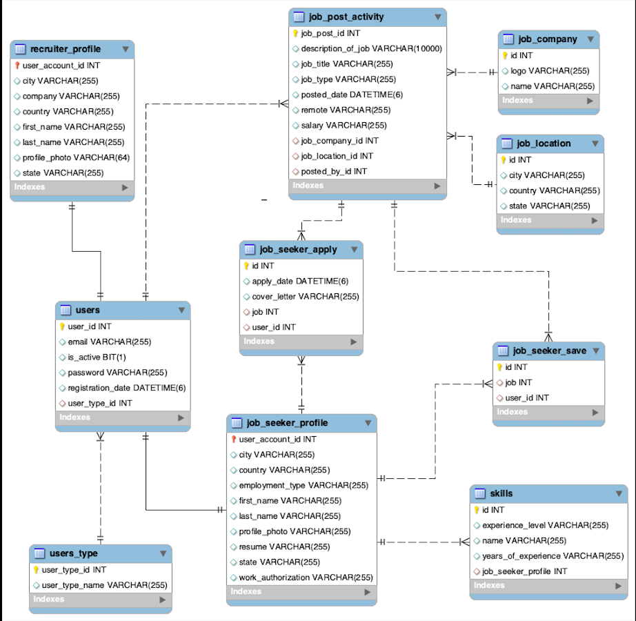

# Job_Portal_Application

Welcome to my Job Portal Application! This project is built using Spring Boot, Spring Security, Spring MVC, Spring JPA/Hibernate, MySQL, and Thymeleaf for HTML/CSS/JavaScript.

## Table of Contents

* Introduction
* Database structure
* Features
* Job Seekers
* Recruiters
* Technologies Used
* Installation
* Usage
* Job Seeker Workflow
* Recruiter Workflow
* Contributing
* License

## Introduction
This application allows job seekers to find and apply for jobs, and recruiters to post and manage job listings. It provides a seamless and user-friendly interface for both job seekers and recruiters to interact with the job portal.

## Database Structure

## Features
The features for the Job seekers and Recruiter are given below :

#### Job Seekers/candidate
* Register as a job seeker
* Login to the portal
* Edit account details
* Upload resume
* Upload profile picture
* View all available jobs in the dashboard
* Filter jobs based on location, job type, job name, and date posted
* Save jobs for later application
* Apply for jobs
* Check application status
* Logout of the account

#### Recruiters
* Signup as a recruiter
* Login to the portal
* Edit profile details
* Upload profile picture
* Post new jobs with description, location, type, etc.
* View all job seekers who have applied for a given job posted by the recruiter
* Download resumes and view profiles of job seekers

## Technologies Used
* Spring Boot: for robust backend
* Spring Security: for secure authentication
* Spring MVC: for smooth web interactions
* Spring JPA/Hibernate: for efficient database operations
* MySQL: for reliable data storage
* Thymeleaf: for dynamic front-end rendering
* Bootstrap: for responsive and modern UI design

## Usage

#### Job Seeker Workflow :
* Register: Create a new account as a job seeker. 
* Login: Access your account using your credentials. 
* Edit Profile: Update your account information, upload your resume and profile picture. 
* View Jobs: Browse available jobs from the dashboard. 
* Filter Jobs: Use filters to narrow down job listings based on your preferences. 
* Save Jobs: Bookmark jobs you are interested in applying for later. 
* Apply for Jobs: Submit applications for jobs directly through the portal. 
* Check Applications: Monitor the status of your job applications. 
* Logout: Securely log out of your account.

#### Recruiter Workflow :
* Signup: Create a new account as a recruiter. 
* Login: Access your account using your credentials. 
* Edit Profile: Update your profile information and upload your profile picture. 
* Post Jobs: Add new job listings with detailed descriptions, location, and type. 
* View Applicants: See all job seekers who have applied for your job postings. 
* Manage Jobs: Keep track of all jobs you have posted, download resumes, and view profiles of applicants. 
* Logout: Securely log out of your account.

## Contributing
Contributions are welcome! Please fork the repository and create a pull request with your changes. Thank you!
